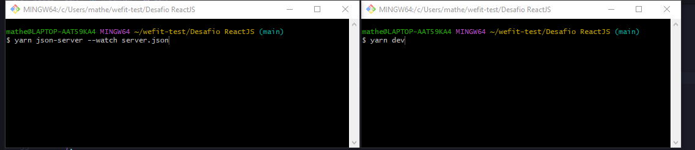

# React + TypeScript + Vite

## Rodar projeto
Primeiro instale o `node_modules` com o comando `yarn` ou `npm i`.
Agora é preciso rodar dois comandos em terminais de linha de comando separados
- Comando `yarn json-server --watch server.json` para iniciar o servidor fake;
- Comando `yarn dev` para iniciar o projeto.
   Como a imagem abaixo

   
Feito isso basta acessar `http://localhost:5173` e você pode começar a navegar pela aplicação